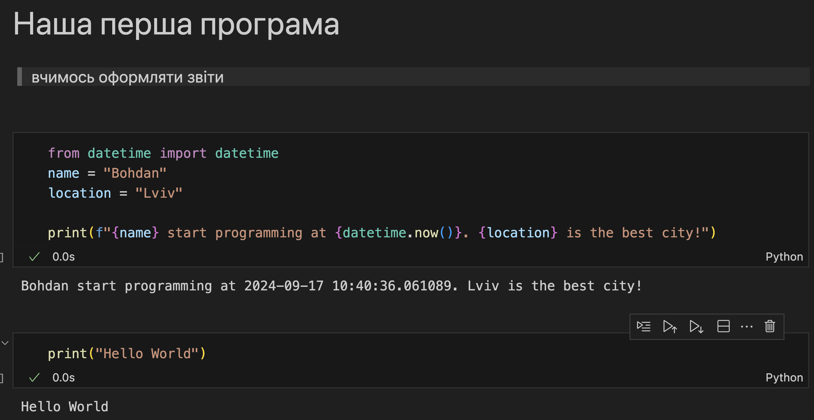

# Звіт до роботи 1
## Тема: Вступ
### Мета роботи: налаштувати середовище, створити репозиторій, попрацювати з Markdown та оформити звіт

---
### Виконання роботи
* Результати виконання завдань:
    1. Репозиторій створено, [посилання на нього](https://github.com/BobasB/2024_kn41_nm);
    1. Навчились працювати з репозиторієм та налаштували інтеграцію з Visual Studio Code;
    1. Написали першу програму та запустили її. Програма вивела текст представлений на скріншоті:
    
    1. Створили Пайтон Ноутбук та виконали тестову програму в ньому. Програма надрукувала те що представлено на скріншоті:
    
    1. Навчились працювати з Пайтоном, запускати програми та оформлювати звіти;

* Результат що нам видав ChatGPT .....:
    > тут має бути щось від ChatGPT

* результати виконання індивідуального завдання (якщо такі є);

---
### Висновок:
> у висновку потрібно відповісти на запитання:

- :question: Що зроблено в роботі;
- :question: Чи досягнуто мети роботи;
- :question: Які нові знання отримано;
- :question: Чи вдалось відповісти на всі питання задані в ході роботи;
- :question: Чи вдалося виконати всі завдання;
- :question: Чи виникли складності у виконанні завдання;
- :question: Чи подобається такий формат здачі роботи (Feedback);
- :question: Побажання для покращення (Suggestions);

---